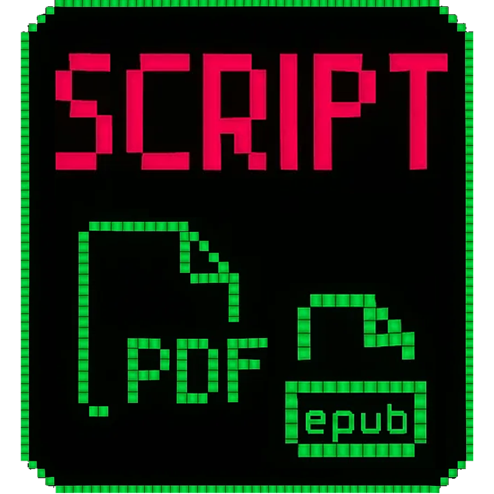
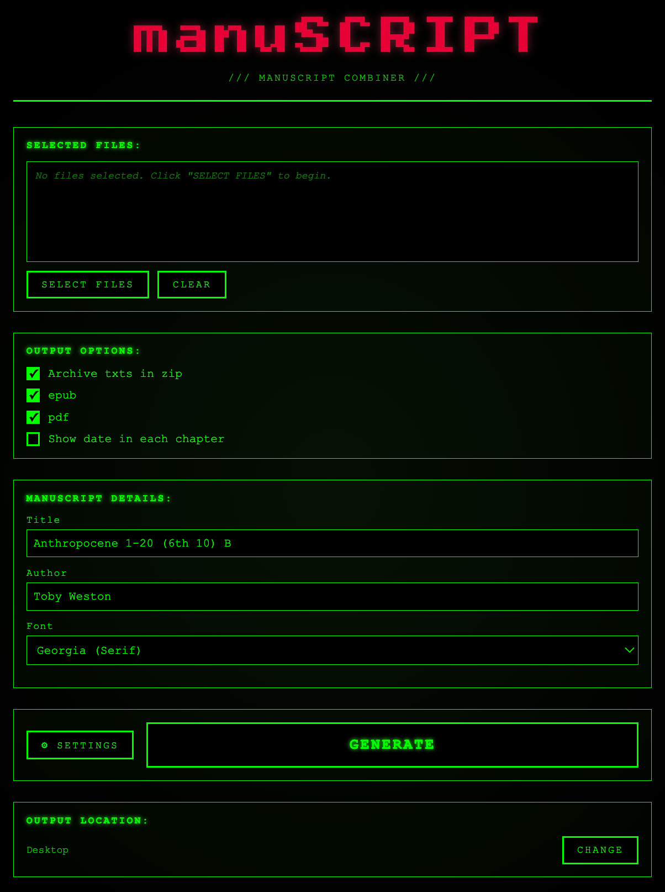

# manuSCRIPT

<div align="center">
  
</div>

A retro terminal-styled desktop application for combining chapter text files into professional manuscript formats (PDF, EPUB, ZIP).



## Features

### 📝 File Management
- **Multi-file selection** - Select multiple chapter files at once (.txt, .md, .rtf)
- **Drag-and-drop support** - Simply drag chapter files into the app
- **Automatic chapter detection** - Extracts chapter numbers, dates, and titles from filenames
- **Smart sorting** - Automatically orders chapters by chapter number
- **File validation** - Warns about missing chapter numbers or duplicates

### 📚 Output Formats
- **PDF Generation** - Professional PDF with customizable fonts, margins, and spacing
- **EPUB Generation** - E-reader compatible EPUB with table of contents
- **ZIP Archive** - Backup of all source text files
- **Multiple outputs** - Generate all formats simultaneously

### ⚙️ Customization
- **Font Selection** - Choose from Georgia (Serif), Arial (Sans), or Courier New (Mono)
- **Page Settings** - A4 or A5 page sizes
- **Margins** - Adjustable top, bottom, left, and right margins (mm)
- **Line Spacing** - Single, 1.5, or double spacing
- **Paragraph Spacing** - Customizable spacing between paragraphs
- **Chapter Headers** - Adjustable font size, bold, and italic options
- **Date Display** - Optionally show dates extracted from chapter filenames
- **Title Filtering** - Remove custom separators from chapter titles

### 📊 Manuscript Statistics
- **Word Count** - Total word count displayed on PDF cover page
- **Page Estimate** - Estimated page count (Standard Paperback Pages @ 325 words/page)
- **Chapter Range** - Display chapter range (e.g., "Chapters 1-45")
- **Generation Summary** - Shows formats created, file sizes, and chapter count

### 💾 Smart Defaults
- **Persistent Settings** - All preferences saved between sessions
- **Remember Inputs** - Manuscript title and author auto-saved
- **Custom Output Location** - Choose where to save generated files (default: Desktop)
- **Auto-versioning** - Automatically creates versioned folders (e.g., `Title_v2`) to avoid overwriting

### 🛡️ Error Handling
- **File Read Errors** - Gracefully handles unreadable files and continues processing
- **Disk Space Check** - Validates sufficient space before generation
- **Long Filename Support** - Truncates display while preserving full paths
- **Special Character Handling** - Sanitizes filenames for safe directory creation
- **Warning Display** - Shows which files failed with detailed error messages

### 🎨 Retro Terminal UI
- **CRT-inspired design** - Green-on-black terminal aesthetic with glow effects
- **Progress tracking** - Real-time progress bar during generation
- **Visual feedback** - Input validation with shake animations and red highlights
- **Accessible interface** - Clear error messages and status updates

## Installation

### macOS
1. Download `manuSCRIPT-1.0.0-arm64.dmg`
2. Open the DMG file
3. Drag manuSCRIPT to your Applications folder
4. Launch from Applications
5. **First launch:** Right-click → "Open" → Click "Open" to bypass security warning (app is not code-signed)

### From Source
```bash
# Clone repository
git clone https://github.com/yourusername/manuscript-app.git
cd manuscript-app

# Install dependencies
npm install

# Run in development
npm start

# Build for macOS
npm run build:mac

# Build for Windows
npm run build:win
```

## Usage

### Basic Workflow
1. **Select Files** - Click "SELECT FILES" or drag-and-drop chapter files
2. **Review** - Check chapter order and titles in the file list
3. **Configure** - Enter title and author, choose output formats
4. **Customize** (Optional) - Click "⚙ SETTINGS" to adjust fonts, margins, spacing
5. **Generate** - Click "GENERATE" to create your manuscript
6. **Open Folder** - Click the output path link to view generated files

### File Naming Convention
For automatic chapter detection, name your files like:
- `1_chapter_title.txt` → Chapter 1: "chapter title"
- `01_1972_title.txt` → Chapter 1 (1972): "title"
- `Chapter 2 - AD 1982 - Title.txt` → Chapter 2 (AD 1982): "Title"
- `3 - BCE 30000 - Title.md` → Chapter 3 (BCE 30000): "Title"

### Output Structure
```
Desktop/
└── Your_Manuscript_Title/
    ├── Your_Manuscript_Title.pdf
    ├── Your_Manuscript_Title.epub
    └── Your_Manuscript_Title_source.zip
```

## Settings Reference

### Page Settings
- **Page Size:** A4 (595×842pt) or A5 (420×595pt)
- **Margins:** Top, Bottom, Left, Right (in millimeters)

### Typography
- **Line Spacing:** Single (1.0), 1.5, or Double (2.0)
- **Paragraph Spacing:** Space between paragraphs (in points)
- **Chapter Font Size:** Size of chapter headers (default: 18pt)

### Title Filtering
Add comma-separated strings to ignore in chapter titles:
- Default: `-d-, --, -- HERE --, --c--`
- Example: Removes separators like "Chapter 1 -- HERE -- Title" → "Chapter 1 Title"

## Technical Details

### Built With
- **Electron** - Cross-platform desktop framework
- **PDFKit** - PDF generation
- **epub-gen** - EPUB creation
- **Archiver** - ZIP compression

### Requirements
- macOS 10.12+ (for built app)
- Node.js 16+ (for development)

### File Support
- `.txt` - Plain text files
- `.md` - Markdown files
- `.rtf` - Rich text format files

## License

MIT License - See LICENSE file for details

## Support

For issues, questions, or feature requests, please open an issue on GitHub.

